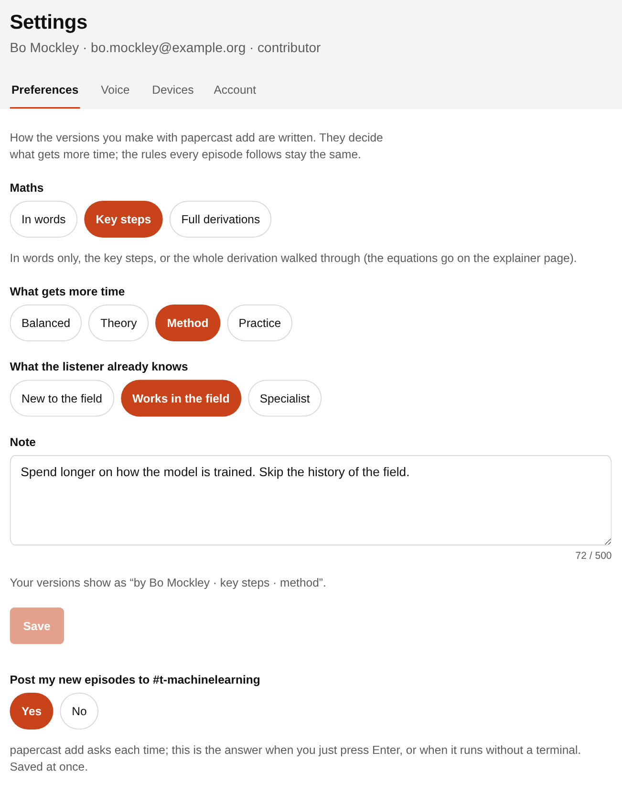
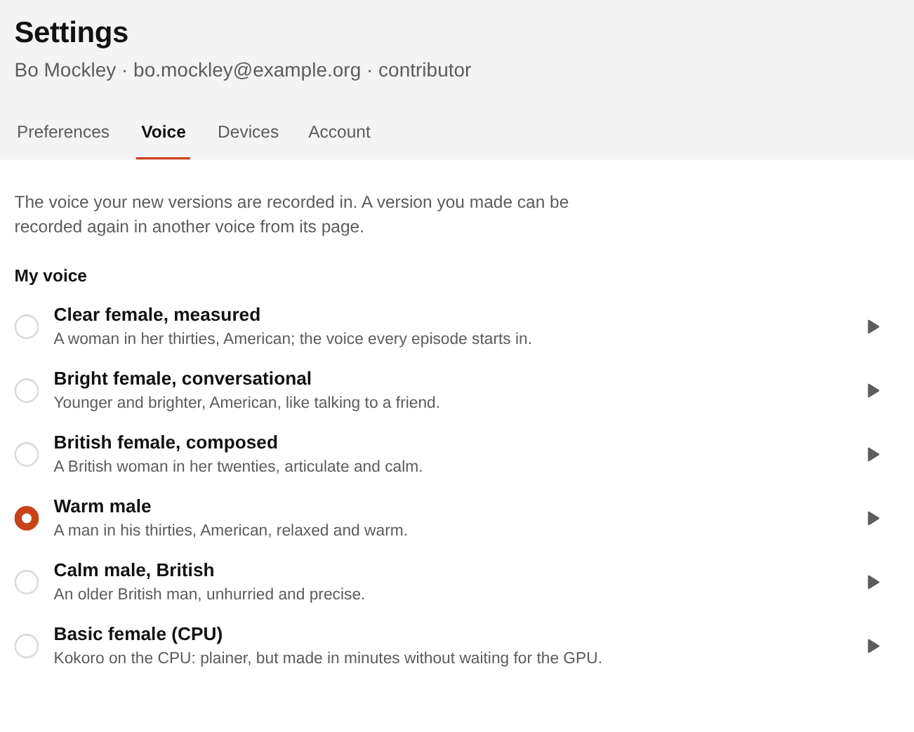
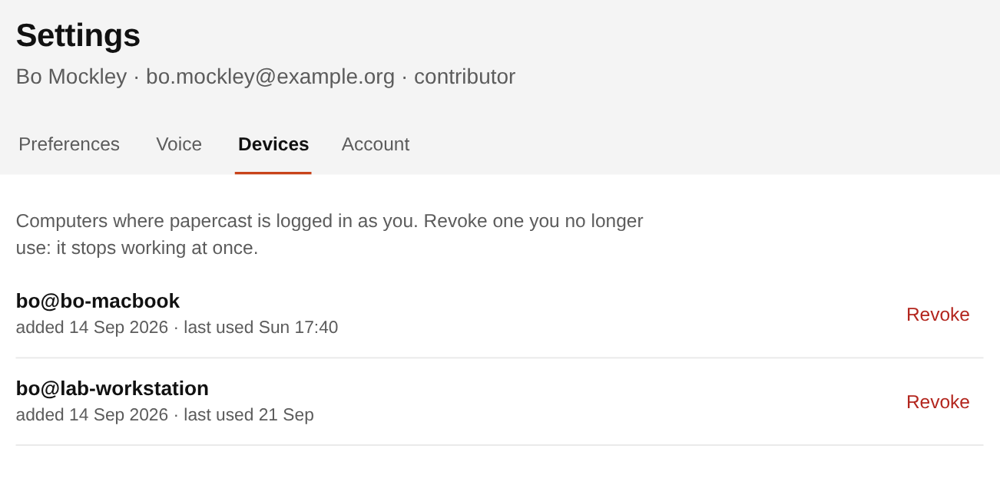
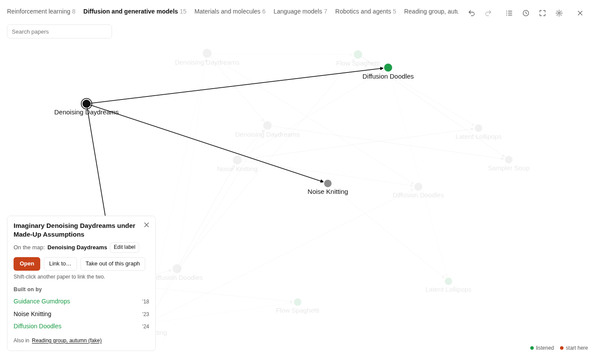
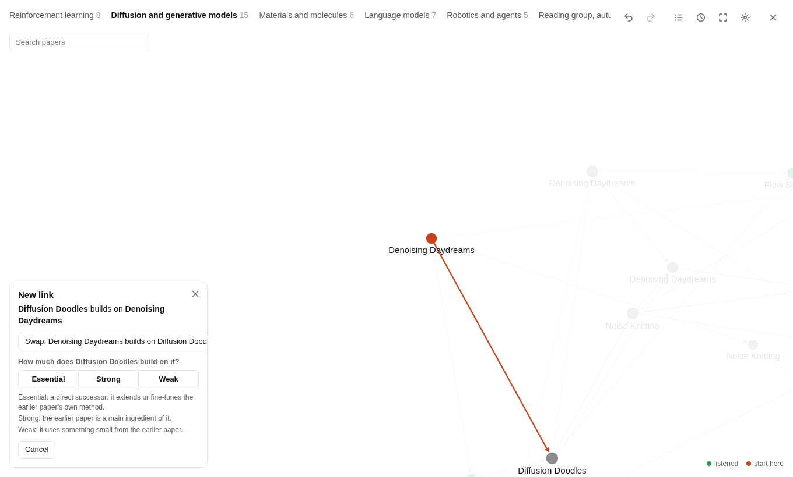
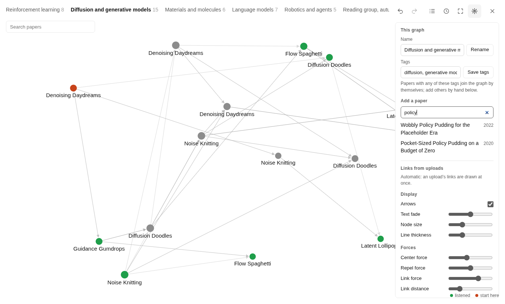

# papercast-group

The Virtual Atoms Lab's paper podcasts: https://papercast.virtualatoms.org

Each paper becomes a spoken episode, a one-screen explainer page and a place on the paper map.
Anyone in the group can listen on the site. To add papers you use the `papercast` command on
your own computer. It runs Claude Code there, under your own Claude login, to write the
episode. The site (the "hub" in the terminal messages) then records the voice and puts the
episode in the library and on the map.

This page shows how to add papers and how to work on the map. Listening needs no guide.

## 1. What you need

- **A Mac or a Linux computer.** On Windows, use WSL (Windows Subsystem for Linux): open
  PowerShell as administrator, run `wsl --install`, restart, and open "Ubuntu" from the Start
  menu. Run every command below in that Ubuntu window.
- **An account on the site.** You get a welcome email (look in junk too). Your username is
  the part of your Imperial email before the @: for `ab1234@ic.ac.uk` it is `ab1234`, and the
  first password is the same. The site asks you for a new password the first time you sign
  in. Adding papers needs the contributor role; if you are a viewer, ask Leo.
- **Python 3.10 or newer, git and pipx.** Section 2.1 installs them.
- **Claude Code, installed and logged in** with a Claude plan that includes it (Pro, Max,
  Team or Enterprise; the free plan does not). **Every paper you add runs on your own Claude
  usage:** one long Claude Code session on your computer (the Opus model), plus a short one that
  grades the paper's links. It counts against your plan's limits like any other Claude Code
  work. Your Claude login never leaves your computer; the site only receives the finished
  episode.
- **Access to the code on GitHub.** The repository is private. Send Leo your GitHub username
  first (section 2.3).

## 2. Install

### 2.1 pipx and git

Ubuntu 22.04 or newer (and WSL):

```
sudo apt update
sudo apt install -y pipx git poppler-utils
pipx ensurepath
```

macOS (with [Homebrew](https://brew.sh)):

```
brew install pipx git poppler
pipx ensurepath
```

Then close the terminal and open a new one. Poppler is optional: with it the explainer page can
show crops of the paper's own figures.

### 2.2 Claude Code

```
curl -fsSL https://claude.ai/install.sh | bash
```

Open a new terminal and start Claude Code once:

```
claude
```

A browser opens: sign in with your Claude account. If the browser shows a code instead, paste
it into the terminal. When Claude Code is running, type `/exit`. Check the login:

```
claude auth status --text
```

It prints your login method and email. If it says you are not logged in, run
`claude auth login`.

### 2.3 Access to the private repository

1. Send Leo your GitHub username. He adds you to the repository, and GitHub emails you an
   invitation. Accept it (or open https://github.com/leolou0512/papercast/invitations).
2. Let git use your GitHub login. Install the GitHub command-line tool:

   ```
   sudo apt install -y gh
   ```

   On macOS: `brew install gh`. Then log in once:

   ```
   gh auth login
   ```

   Answer: GitHub.com, HTTPS, Yes (authenticate Git with your GitHub credentials), Login with a
   web browser.

### 2.4 papercast

```
pipx install 'git+https://github.com/leolou0512/papercast#subdirectory=packages/papercast-cli'
papercast --version
```

If you already use an SSH key with GitHub, this works instead of section 2.3's second step:

```
pipx install 'git+ssh://git@github.com/leolou0512/papercast.git#subdirectory=packages/papercast-cli'
```

## 3. Log in to the site

```
papercast login --server https://papercast.virtualatoms.org
```

The terminal shows a link and a code, and your browser opens the link (if it does not, open
the link yourself). Sign in if the site asks, check that the code matches, and press
**Approve**. The terminal then says "Logged in as" with your name. This computer now shows
under Settings, Devices. `papercast whoami` tells you who you are logged in as. The ? button at
the top of the paper list shows these commands too, with Copy buttons.

## 4. Add a paper from a PDF file

```
papercast add ~/Downloads/2006.11239.pdf
```

Put the path of your own PDF in place of `~/Downloads/2006.11239.pdf`. A file in the folder you
are in works by its name alone:

```
cd ~/Downloads
papercast add 2006.11239.pdf
```

On WSL, your Windows Downloads folder is under `/mnt/c/Users/`, then your Windows user name
(here `Ada`):

```
papercast add /mnt/c/Users/Ada/Downloads/2006.11239.pdf
```

## 5. Add a paper from a link

```
papercast add https://arxiv.org/abs/2006.11239
```

These links work:

- **arXiv**: an abs, pdf or html link, or just the number: `papercast add 2006.11239`.
  papercast downloads the PDF from arXiv, so this is as good as adding the file.
- **A DOI**: `papercast add https://doi.org/10.1038/s41586-023-06735-9`, or just
  `papercast add 10.1038/s41586-023-06735-9`.
- **A paper's page on a journal or research site**: Nature, Science, ScienceDirect (Elsevier),
  Springer, Wiley, ACS, APS, IOP, RSC, PNAS, Cell, IEEE, ACM, OpenReview, Semantic Scholar,
  PMLR, NeurIPS, JMLR and the ACL Anthology. A direct PDF link on one of these sites is
  downloaded. For a page, Claude reads it on the web, which gives it less to work with than
  the PDF.

Claude can only read those sites. For a link anywhere else, or a paper behind a paywall,
download the PDF and add the file (section 4).

You can add several papers at once, files and links mixed:

```
papercast add ~/Downloads/2006.11239.pdf https://arxiv.org/abs/2011.13456
```

## 6. What happens next

Before it starts, `papercast add`:

- checks that Claude Code is installed and logged in;
- asks the site whether the paper is there already. If it has an episode, you are asked
  "Make your own version? [y/N]" (`--yes` answers yes in advance). Your own version is written
  with your preferences and sits beside the other one. If someone is making the paper right
  now, it is skipped;
- asks once whether to post the new episodes to the group's Slack channel when they are ready,
  if the site has Slack set up. Enter takes your default (Settings, Preferences). `--slack` or
  `--no-slack` answers it in advance: `papercast add --no-slack ~/Downloads/2006.11239.pdf`.

Then it works in the background, at most two papers at a time. Closing the terminal is fine.
Follow it with:

```
papercast status
```

Each paper goes through these steps on your computer:

1. **reading** and **claiming**: the paper is copied or downloaded, Claude identifies it, and
   papercast tells the site you are making it, so nobody else starts the same paper.
2. **writing**: papercast fetches the group's newest guideline (how an episode is made) and
   your preferences from the site, and Claude writes the script and the explainer page. This
   is the long part.
3. **checking** and **cutting**: papercast checks the script (for example no digits, never
   talking to the listener, 15 to 25 minutes long). Anything wrong goes back to Claude once,
   with the reasons; if it is still wrong, the paper fails and `papercast status` says why.
   Then Claude may only delete sentences: asides, comparisons with other work, and repeats.
4. **explainer**, **links**, **uploading**: the page is built, the paper's references and
   citations are matched with papers already on the site, and everything is sent to the site.

Then the site takes over. `papercast status` shows its side: "the hub is checking it" (the
site checks the script again), "waiting for the voice" (the voice is recorded on the group's
GPU server, one episode at a time, in a queue), "being voiced", and finally "ready" with the
link to the paper.

On the site the episode is in the library, marked "by" your name and your preferences. On the
map it joins every graph whose topic tags match the paper's, with arrows to and from the papers
already there that it builds on or that build on it. If an admin set links from uploads to
"Suggest only", those arrows wait as dashed suggestions until someone accepts them.

Sometimes papercast only finds out that a paper is on the site already once Claude has read its
title. Then `papercast status` shows the question and the two answers, for example
`papercast retry jk3x7qa --yes` (make your own version) or `papercast cancel jk3x7qa` (do not).
Use the job id that `papercast status` shows in place of `jk3x7qa`.

## 7. Settings

Open Settings with the gear at the top of the paper list.

**Preferences** decide how the versions you make are written: how much maths, what gets more
time, what the listener already knows, and a note for the writer (up to 500 characters). The
rules every episode follows stay the same. A paper uses the preferences saved when it starts
writing. The last part is your default answer to the Slack question.



The same from the terminal:

```
papercast prefs
papercast prefs --maths key-steps --emphasis method --background field
papercast prefs --note "Spend longer on how the model is trained. Skip the history of the field."
papercast prefs --slack off
```

The choices are `--maths words|key-steps|full`, `--emphasis balanced|theory|method|practice`
and `--background newcomer|field|specialist`. `--note ""` clears the note.

**Voice** is the voice your new versions are recorded in. The play button plays a sample. To
record a version you made again in another voice, open it on the site and press **Change**
next to "Voice".



**Devices** lists the computers where papercast is logged in as you. Revoke one you no longer
use; it stops working at once. **Account** changes your password.



## 8. Working on the map

Open the map with the button next to the gear (three joined dots). There is one tab per graph.
An arrow goes from a paper to a later paper that builds on it. Anyone signed in can change a
graph, except a locked one, which only admins change.

- **Pick a paper**: click it, or type part of its title in "Search papers" and press Enter.
  Its card shows what it builds on and what builds on it.

  

- **Link two papers**: pick the earlier paper, press **Link to…**, then click the later one
  (or Shift-click it). Choose how much it builds on the earlier one: Essential, Strong or Weak.
  If the arrow points the wrong way, press **Swap**.

  

- **Change or remove a link**: click the arrow, then pick another grade or **Remove link**.
- **Add a paper to the graph**: open Graph settings (the gear on the map), type part of a title
  under "Add a paper" and click the paper. Papers with the graph's tags join by themselves.

  

- **Take a paper out of the graph**: pick it and press **Take out of this graph**.
- **Make a graph**: the **+ New graph** tab, with a name and, if you like, topic tags.
- **Undo and Redo**: the two curved arrows at the top, or Ctrl+Z and Ctrl+Shift+Z (Cmd on a
  Mac). Undo says what it will undo, and lets you choose your own last edit or the last edit by
  anyone. The clock button lists the last 100 changes.

## 9. Updating

```
pipx reinstall papercast
```

This installs the newest papercast from GitHub. You do not need it for the newest guideline:
every paper fetches that from the site when it starts writing. Claude Code updates itself;
`claude update` updates it now.

## 10. When something goes wrong

- **"Claude Code is not logged in"**: run `claude auth login`, then
  `claude auth status --text` to check.
- **Claude's usage limit**: `papercast status` shows "Claude limit · resumes" and a time. The
  paper waits and goes on by itself from where it stopped. Leave the computer on. After a
  restart, run `papercast status` once and it carries on. To try again now:
  `papercast retry jk3x7qa` (with your job id).
- **A paper failed**: `papercast status` says why and shows `papercast retry` with its id. A
  paper that could not reach the site to fetch the guideline waits for that retry; it never uses
  an older copy.
- **The site rejected it**: `papercast status` shows the reasons; `papercast retry` with its id
  makes it again.
- **A link did not work**: download the PDF and add the file.
- **"Not logged in", or the hub refused this device**: run
  `papercast login --server https://papercast.virtualatoms.org` again.
- **"Uploading needs the contributor role"**: ask Leo.
- **`pipx install` asks for a GitHub password, or says "Repository not found"**: you do not
  have access yet, or `gh auth login` was not run (section 2.3).
- **`papercast: command not found`**: run `pipx ensurepath` and open a new terminal.
- **Stop a paper**: `papercast cancel jk3x7qa` (with your job id).

Running the server is described in `stacks/papercast-group/HANDOVER.md`.
